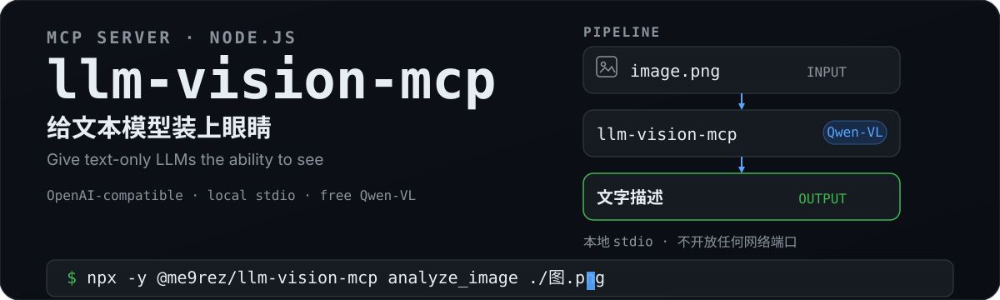

# llm-vision-mcp

<p align="center">
  
</p>

## 这是什么？

通过 MCP stdio 协议为文本模型提供图片理解能力的本地服务，专注磁盘图片分析：

- 支持任意 OpenAI 兼容的视觉模型供应商（默认 ModelScope 免费的通义千问VL，国内直连，每天 2000 次调用，单模型 500 次），可通过 `BASE_URL` / `VISION_MODEL` 切换
- 通过 MCP stdio 协议供 Claude Code / Opencode 等客户端调用
- 本地进程运行，不开放任何网络端口

**为什么需要？** DeepSeek / GLM 等文本模型的 API 没有视觉能力——给它一个图片路径，它只能"看到"路径本身。本 MCP Server 把图片转成文字描述，让文本模型也能"看图说话"。

## 快速开始

已发布到 npm，**无需克隆仓库**，客户端会通过 `npx` / `pnpm dlx` 自动下载运行：

> **首次使用：获取免费 API Key**（默认 ModelScope 供应商，每天 2000 次调用）
> 1. 打开 https://modelscope.cn 注册/登录
> 2. 右上角头像 → 个人中心 → 访问令牌（或直接访问 https://modelscope.cn/my/myaccesstoken）
> 3. 首次使用需绑定阿里云账号（必须，按页面引导完成）
> 4. 点击"新建访问令牌" → 命名 → 生成 → 复制
> 5. 令牌格式为 `ms-xxxxxxxxxxxx`，**保留 `ms-` 前缀**原样作为 `API_KEY` 使用

```bash
# 验证可用性（启动 stdio MCP Server，Ctrl+C 退出）
npx -y @me9rez/llm-vision-mcp mcp
# 或 pnpm
pnpm dlx @me9rez/llm-vision-mcp mcp
```

然后按下方「客户端配置」把 MCP Server 接入 Claude Code / Opencode / Kimi Code，在 `env` 中注入 `API_KEY` 即可；也可以直接用 CLI 分析图片（见「CLI 使用」）。

### 本地开发

```bash
git clone <仓库地址> && cd llm-vision-mcp
npm install
npm start        # 启动 MCP Server
npm test         # 单元测试
npm run smoke    # 冒烟测试（无需 API Key）
```

## CLI 使用

不接 MCP 客户端时，也可以在终端直接分析图片：

```bash
# 查看帮助（列出全部命令与环境变量）
npx -y @me9rez/llm-vision-mcp --help

# 分析图片（默认通用分析提示词）
npx -y @me9rez/llm-vision-mcp analyze_image ./图片.png

# 带自定义问题
npx -y @me9rez/llm-vision-mcp analyze_image ./图片.png "描述图片中的颜色和字体"

# 其他命令：extract_text（OCR）、describe_ui、diagnose_error、
#          understand_diagram、analyze_chart、code_from_screenshot
# 下划线可替换为短横线（如 extract-text），效果相同

# 启动 MCP Server（stdio 模式）
npx -y @me9rez/llm-vision-mcp mcp
```

```bash
API_KEY=你的密钥 npx -y @me9rez/llm-vision-mcp analyze_image ./图片.png
```

## MCP 工具列表

| 工具 | 功能 |
|------|------|
| `analyze_image` | 分析磁盘图片文件（可传自定义 `prompt`） |
| `extract_text` | 磁盘图片 OCR 提取文字 |
| `describe_ui` | 分析磁盘 UI 图片 |
| `diagnose_error` | 诊断磁盘错误图片 |
| `understand_diagram` | 解读流程图/架构图 |
| `analyze_chart` | 分析数据图表 |
| `code_from_screenshot` | 从磁盘图片提取代码 |

## 客户端配置

**Claude Code**（`.claude/settings.json`）：

```json
{
  "mcpServers": {
    "llm-vision-mcp": {
      "command": "npx",
      "args": ["-y", "@me9rez/llm-vision-mcp", "mcp"],
      "env": {
        "API_KEY": "你的_API_Key"
      }
    }
  }
}
```

> ⚠️ Windows 下如 `npx` 无法直接启动，可将 `command` 改为 `npx.cmd`，或使用 `"command": "cmd", "args": ["/c", "npx", "-y", "@me9rez/llm-vision-mcp", "mcp"]`。
> 完整示例见 `examples/claude_code_settings.json`。

**只启用部分工具**（减少 agent 上下文占用）→ 见「工具白名单（TOOLS）」。

**Opencode**（`%APPDATA%\opencode\opencode.json`）：

```json
{
  "mcp": {
    "llm-vision-mcp": {
      "type": "local",
      "command": ["npx", "-y", "@me9rez/llm-vision-mcp", "mcp"],
      "enabled": true,
      "environment": {
        "API_KEY": "你的_API_Key"
      }
    }
  }
}
```

> 完整示例见 `examples/opencode.json`。

**Kimi Code**（`~/.kimi-code/mcp.json` 用户级，或项目级 `.kimi-code/mcp.json`；同名条目项目级优先）：

```json
{
  "mcpServers": {
    "llm-vision-mcp": {
      "command": "npx",
      "args": ["-y", "@me9rez/llm-vision-mcp", "mcp"],
      "env": {
        "API_KEY": "你的_API_Key"
      }
    }
  }
}
```

> 在 TUI 中运行 `/mcp` 查看连接状态；`/mcp-config` 可交互式增删改 server。接入后工具名为 `mcp__llm-vision-mcp__analyze_image` 格式，权限规则可用 `mcp__llm-vision-mcp__*` 通配。
> 想限制 Kimi Code 可用的工具，除了本项目的 `TOOLS` / `--tools`（见「工具白名单」），还可以用 Kimi 原生的 `enabledTools` 白名单：在 server 条目中加 `"enabledTools": ["analyze_image", "extract_text"]`。

## 工具白名单（TOOLS）

默认情况下 MCP Server 会注册全部 7 个工具，每个工具的定义（名称、参数、说明）都会占用 agent 的上下文 tokens。**只启用你实际需要的工具**能让上下文更小，模型响应更快、更省成本。

> 只影响 **MCP 模式**；CLI 模式直接指定命令，不受 `TOOLS` 影响。

### 配置方式（二选一）

`--tools` 启动参数优先级高于 `TOOLS` 环境变量，两者同时设置时以 `--tools` 为准。

**方式一：`TOOLS` 环境变量**

```json
{
  "mcpServers": {
    "llm-vision-mcp": {
      "command": "npx",
      "args": ["-y", "@me9rez/llm-vision-mcp", "mcp"],
      "env": {
        "API_KEY": "你的_API_Key",
        "TOOLS": "analyze_image,extract_text"
      }
    }
  }
}
```

**方式二：`--tools` 启动参数**

```json
{
  "mcpServers": {
    "llm-vision-mcp": {
      "command": "npx",
      "args": ["-y", "@me9rez/llm-vision-mcp", "mcp", "--tools", "analyze_image,extract_text"],
      "env": {
        "API_KEY": "你的_API_Key"
      }
    }
  }
}
```

### 语法规则

- **逗号分隔**多个工具名，如 `analyze_image,extract_text,describe_ui`
- **snake_case 与 kebab-case 均可**，以下写法等价：`extract_text` ≡ `extract-text`
- **未知工具名被忽略**并打印警告（不影响其他工具）：`TOOLS=analyze_image,foo` 只会启用 `analyze_image`，同时输出 `[llm-vision-mcp] 忽略未知工具: foo`
- **留空或不设置** = 启用全部工具

### 常用组合

```bash
# 只做通用分析 + OCR（最常见）
TOOLS=extract_text,analyze_image

# UI 相关三件套
TOOLS=describe_ui,diagnose_error,code_from_screenshot

# 图表 / 架构分析
TOOLS=understand_diagram,analyze_chart
```

### 验证生效

启动 MCP Server 后，在客户端执行 `tools/list` 即可核对：只启用 2 个工具时，列表里只会出现 `analyze_image` 和 `extract_text`。完整工具清单见「MCP 工具列表」。

## 环境变量

支持任意 OpenAI 兼容的视觉模型供应商，全部通过环境变量配置：

| 变量 | 必填 | 默认值 | 说明 |
|------|------|--------|------|
| `API_KEY` | 是 | - | 供应商密钥（ModelScope 令牌**保留 `ms-` 前缀**原样使用） |
| `BASE_URL` | 否 | `https://api-inference.modelscope.cn/v1` | OpenAI 兼容接口地址，可替换为任意供应商 |
| `VISION_MODEL` | 否 | `Qwen/Qwen3-VL-8B-Instruct` | 视觉模型名（如 `Qwen/Qwen3-VL-235B-A22B-Instruct`） |
| `TEMPERATURE` | 否 | `0.7` | 采样温度（数字，如 `0` / `0.5`） |
| `MAX_TOKENS` | 否 | `8192` | 最大生成长度（正整数） |
| `TOOLS` | 否 | （全部） | 工具白名单，逗号分隔（如 `analyze_image,extract_text`）；留空启用全部。**仅影响 MCP 模式**，详见「工具白名单」 |

**配置其他供应商示例**（如本地 Ollama / vLLM 部署）：

```json
{
  "mcpServers": {
    "llm-vision-mcp": {
      "command": "npx",
      "args": ["-y", "@me9rez/llm-vision-mcp", "mcp"],
      "env": {
        "API_KEY": "sk-xxx",
        "BASE_URL": "http://localhost:8000/v1",
        "VISION_MODEL": "qwen2.5-vl-7b",
        "TEMPERATURE": "0.2",
        "MAX_TOKENS": "8192"
      }
    }
  }
}
```

## 安全

- 本地 stdio 进程运行，不开放任何网络端口
- 仅接受图片格式（`.png .jpg .jpeg .gif .webp .bmp`），防止 LLM 注入后读取任意文件
- 文件大小限制 20MB，扩展名 + 魔数双重校验
- 图片经 base64 编码发送至视觉模型供应商 API，参阅其隐私政策

## 参考来源

- [deepseek-eyes](https://github.com/Shaohan-He/deepseek-eyes)（MIT）— 本项目参考的原始项目：MCP Server + 通义千问VL，原项目为 Python 实现并含剪贴板工具；本项目以 Node.js 重写并移除了剪贴板工具
- 视觉模型：通义千问VL / Qwen-VL via [ModelScope](https://modelscope.cn)

## License

MIT — 详见 [LICENSE](./LICENSE)